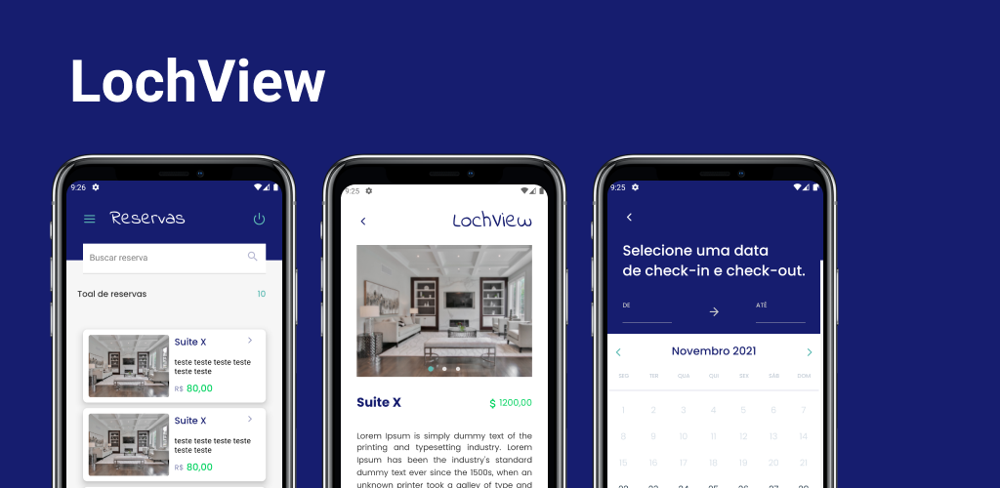

# LochView - Reserva de quartos



## 🔽 Download do APK final

Disponível [aqui](https://github.com/lmiguelm/lochview-mobile/blob/master/dist/LochView.apk)

## 🚀 Tecnologias:

Esse projeto foi desenvolvido com as seguintes tecnologias:

- [React Native](https://reactnative.dev/)
- [Typescript](https://www.typescriptlang.org)
- [Expo](https://expo.io/)
- [Styled-components](https://https://styled-components.com/)
- [AppCenter](https://appcenter.ms)

## 💾 Backend

Disponível [aqui](https://github.com/gabrielstyce/lochview-nestjs-api).

## 💻 Como usar em ambiênte de desenvolvimento

- **_Clone o projeto:_** <br>

  ```
   git clone https://github.com/lmiguelm/lochview-mobile.git
  ```

- **_Entre na pasta do projeto:_** <br>

  ```
    cd lochview-mobile
  ```

- **_Baixe as dependências:_** <br>

  ```
   yarn || npm install
  ```

- **_Rodar o app:_** <br>
  - Com um device do Android Studio aberto, rode o comando:
  ```
  yarn android
  ```
